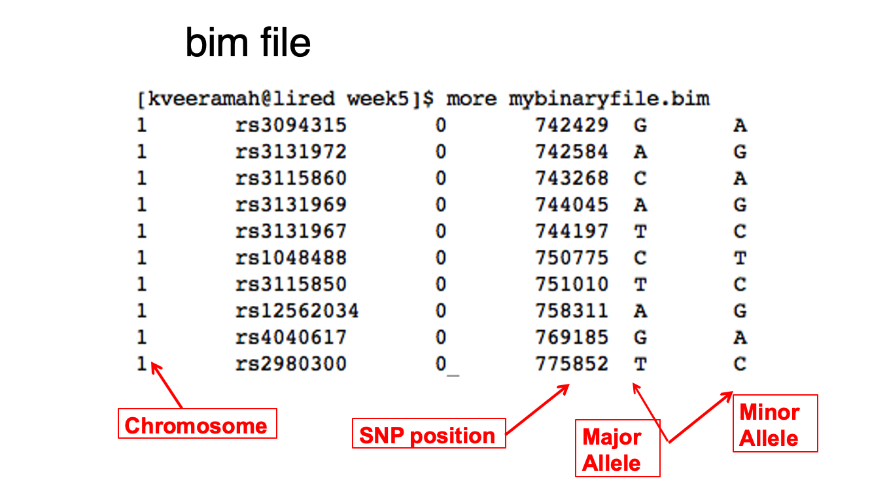
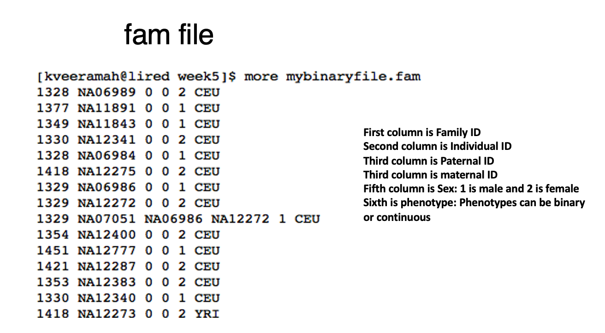

 
# Data Wrangling in Unix

This tutorial will help you master essential Unix commands for data wrangling. We will focus on `grep`, `awk`, and using pipes to manipulate data effectively. 

## Exercise 0: Getting Started and Review of Unix Basics 1
As always please navigate to your personal student directory. 
First you must make a directory called `Unix_Basics_2` using `mkdir`. Next, ensure you have the plink binary Ethiopian files into your `Unix_Basics_2`.  These files are located
in the `/share/ant157/unix_test_data` folder. Please use the `cp` command to copy the `.fam` `.bim` and `.bed` files into your folder. 

### Question 1: How would you copy these files into your folder?
```bash
Type answer here
```

### Wildcards `*`

Instead of copying these files one by one you can also use a wildcard, `*`, to copy files.  
Run `cp /share/ant157/unix_test_data/Ethiopians* .`  
What do you notice? 

### Question 2: What do you notice in your folder when you use a wildcard to copy the files? 
```bash
Type answer here
```

We just want to work with the `.bim` and `.fam` files today so use `rm` to delete the other Ethiopian files you copied over with a wild card

### Question 3: How did you use `rm` to erase the unwanted files
```bash
Type answer here
```
Now let's go over two plink binary file structures the `.fam` and `.bim` 






#### Now experiment with using `head` and  `less` and `cat` commands we learnt from our last lesson to explore your plink files. 

## Exercise 1: Using `wc` for data exploration

**Objective:** Find the number of individuals and snps in the plink binary files.
We now know that the .bim file stores all the SNPs while the .fam file stores all the individuals. If we wanted to count these numbbers we can use the `wc` command. By default `wc` prints out number of lines, word count, byte and characters count in the files specified. When used in tandem with the ` -l` flag we can specify lines only. Try running below

```bash
wc -l Ethiopians_chr1.bim
```
## Question 1a: How many snps are in the plink binary file?

```bash
Answer:
```
## Question 1b: How many individuals are in the plink binary file?

```bash
Answer: 
```

## Exercise 2: Using `grep` to Filter Data

grep means Global Regular ExPression, it is a search tool that can look through text files for strings (sequences of characters).
**Objective:** Extract all lines containing the allele "G" from `Ethiopians_chr1.bim`.

Try running below:

```bash
grep 'G' Ethiopians_chr1.bim
```
## Question 2A: What do you notice?
```bash
Answer: 
```
We can actually extend the code above to save the filtered file in your folder using `>`. 

```bash
grep 'G' Ethiopians_chr1.bim > Ethiopians_chr1_G_only.bim
```
Now Repeat this to filter for 'A', 'T', 'C'

## Question 2B: How did you filter for the other three nucleotides? How many snps are in each filtered file?
```bash
Answer: 
```

## Exercise 3: Introduction to `awk`
Awk is a flexible command line tool used for pattern scanning and processing. It searches one or more files to see if they contain lines that matches with the specified patterns and then perform the associated actions. Awk is abbreviated from the names of the developers – Aho, Weinberger, and Kernighan. 

AWk has the general syntax of

```bash
awk options 'selection _criteria {action }' input-file 
```
or if you wanted to write the the result into a file we leverage `>` introduced earlier

```bash
awk options 'selection _criteria {action }' input-file > output-file
```

**Objective:** Use `awk` to print the RSID and alleles from `Ethiopians_chr1.bim`.

```bash
awk '{print $2, $5, $6}' Ethiopians_chr1.bim
```
## Question 3A: Use `awk` to select the snp position and alleles columns and save it to a file called `Ethiopians_chr1_position_and_alleles.txt`

```bash
Answer: type your code here
```
## Question 3B: How many lines does `Ethiopians_chr1_position_and_alleles.txt` have ?

```bash
Answer: type your code here
```
## Exercise 4:  Using Pipes
A pipe (`|`) allows stringing together multiple commands. For example

```bash
head Ethiopians_chr1.fam | wc -l
```
Above we got the first 10 individuals of the .fam file and "piped" it to count the number of lines.

## Question 4A: use `tail` on `Ethiopians_chr1.fam` and pipe it to count the number of lines, saving the output to a file called `Ethiopians_chr1_tail_count.txt`

```bash
 type your code here
```
We can do more complex pipes by combining `grep` and `awk` 
**Objective:** Find all lines with the allele "A" and print only their RSID and position, saving the output to a file called `Ethiopians_chr1_A_only.txt`

```bash
grep 'A' Ethiopians_chr1.bim | awk '{print $2, $4}' > Ethiopians_chr1_A_only.txt
```

How many lines does `Ethiopians_chr1_A_only.txt` have?

#### Bonus question 1: what would happen if I switched the command above to `awk '{print $2, $4}' Ethiopians_chr1.bim | grep 'A'`. I dont want you to run code  
just explain in words using logic what the code is doing and what you expect to see.
Answer:

#### Bonus question 2: Lets do a triple pipe! Find all lines with the allele "A" on the first 10 lines of Ethiopians_chr1.bim  and print only their RSID and position, saving the output to a file called `head_Ethiopians_chr1_A_only.txt
Answer:

## Exercise 5: Using `awk` for Complex Data Extraction

**Objective:** List individuals from the `Ethiopians_chr1.fam` file with a phenotype value of -9.

Remember from earlier when we used grep it printed out all lines with G. But what if we were interested in only the Minor allele column (6th column) with the letter G? It would be messy to use grep for this. Awk is more flexible and allows us to specify what structure we want.

```bash
awk '$6 == "G" {print $1, $2, $5, $6}' Ethiopians_chr1.bim
```
## Question 5A: What is the code above doing? Remember that the syntax for `awk` is `awk options 'selection _criteria {action }' input-file`

```bash
 type your answer here
```
**Objective:** Find phenotype errors 
In .fam files, phenotypes with a `-9` means that thereis no phenotype available. Do you remember what column stores phenotypes in .fam files? 

```bash
awk '$6 == -9 {print $1, $2, $5}' Ethiopians_chr1.fam
```
The code block above used `awk` to check the sixth field for -9 and prints the first two fields (family and individual IDs). 
Note that when filtering for a number there was no need for double quotes " " but earlier when we filtered for a string "G" it was encased in double quotes.

## Question 5B: How many people are SHEKO in the .fam file? How many people are BENCH? You can use either awk or grep. Please shw me solutions using both

```bash
 type your answer here
```


 
